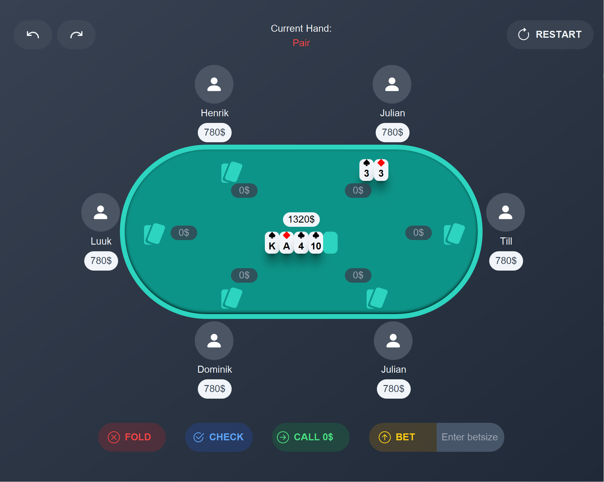

# Poker

## von Henrik und Julian

## Overview

Poker is a game developed by our team as part of the Software Engineering course at HTWG Konstanz. In this collaborative effort, we employed Scala 3 to meticulously craft a resilient Text User Interface and a sleek Graphical User Interface, enhancing the overall Poker gaming experience.

## Getting Started

### Prerequisites

    - Scala 3
    - sbt
    - java 17
    - Docker (optional)

### Installation and Execution

    1. Clone the repository.
    2. Navigate to the project directory.
    3. Set your Codepage to 65001 by executing "chcp 65001" to correctly display UTF-8 characters in the TUI.
    4. Start the game with sbt run.
